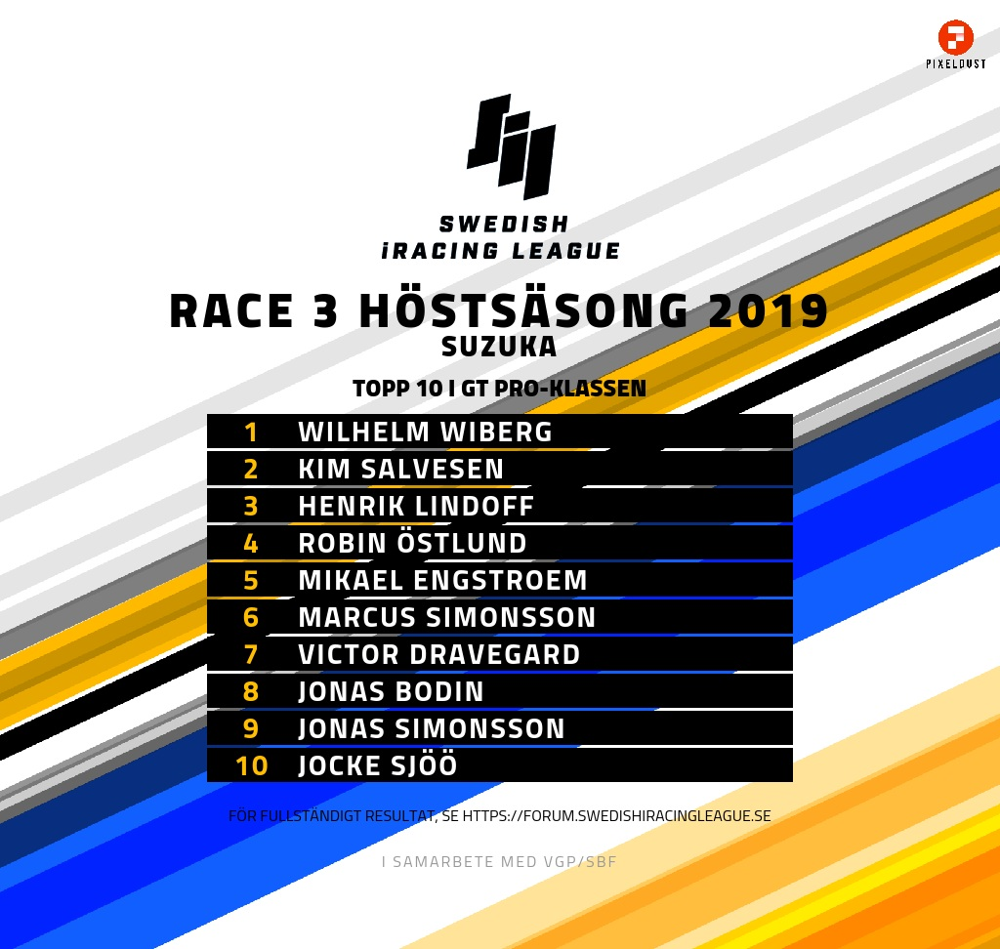

# iRacing Results Table Generator



Generates result images for top 10 for each class in the results csv file

## Usage
1. Place a file named ```results.csv``` in the ```app``` directory
2. Add car classes in the main-method in ```app/app.py``` to the class_list.
3. Run ```docker-compose up```
4. Files are placed in the ```app/output/``` directory, named after the car class, as defined in ```app/constants.py```

## Customization
Make changes in template.html for styling and static text.

***IMPORTANT***: do not remove the ```<table>``` element.

Place any images in the images folder, this is then copied over by the program to the output directory.

## Technology
* Python
* Docker
* imgkit

### TODO
* Handle league races
* Handle team events
* More car classes to constants
